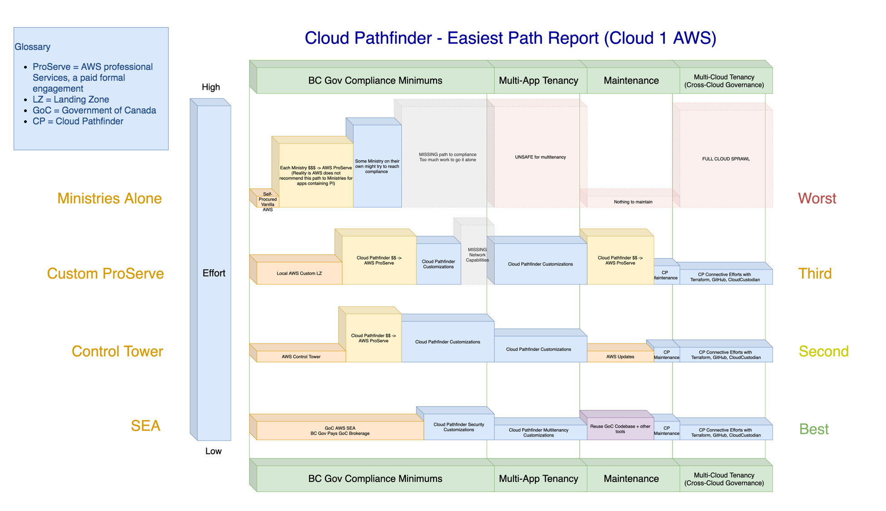
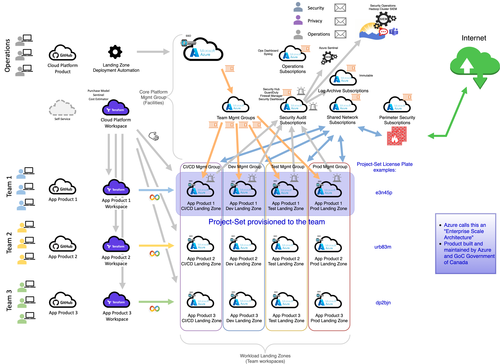

# Providing an SEA Service

## The SEA is non-trivial
 * There is a lot of complexity that is simplified by Cloud Pathfinder providing SEA as a service to Ministries
 * Several thousand dollars per month to run empty
 * Requires a full-time highly-skilled team to stay on top of it

The Below Images shows the Complexity of the SEA

 * AWS calls this a “Lightweight Landing Zone”
 * Product Custom built by AWS Professional Services “ProServe”

## BC Gov AWS SEA
 
 * AWS calls this an “Enterprise Landing Zone”
 * Product built & maintained by AWS and GoC Government of Canada

## BC Gov Microsoft Azure SEA

