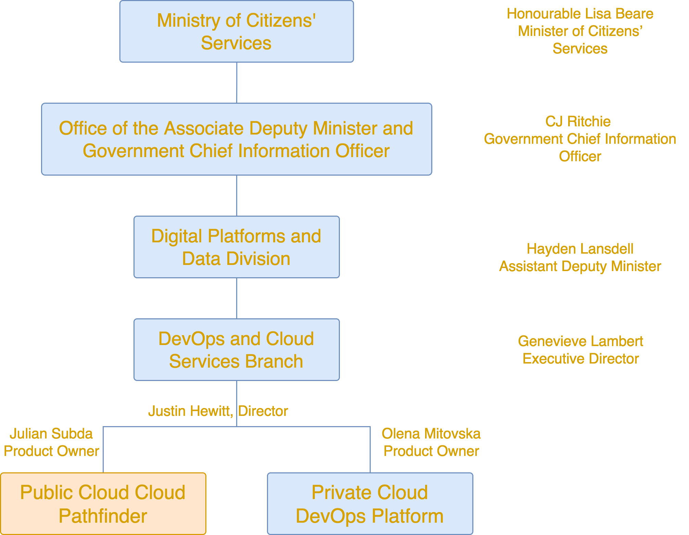

# About BC Gov Cloud
* What is BC Gov Cloud Pathfinder ?

    * We’re a central team in BC Gov tasked with delivering Cloud
    * We’ve onboarded to the GoC Cloud Brokerage
    * We have a service order with 1 Cloud Service Provider that includes an Secure Environment Accelorator (SEA)
    * We are on a mission to collaborate with the GoC to use several Cloud Security Providers (CSPs)
    * We want to offer a consistent service experience across several clouds; our on-prem OpenShift container platform, AWS and others.
    * Our clients are all Ministries in BC Government

* Customer Focus

    * Our Customers: Project Managers / Product Owners / Expense Authorities
    * Our Users: Developer Teams
    * Compliance Users: Security Operations OCIO

* Good Service
    * Who do I go to if I have quality issues with Cloud Pathfinder’s service?
    

