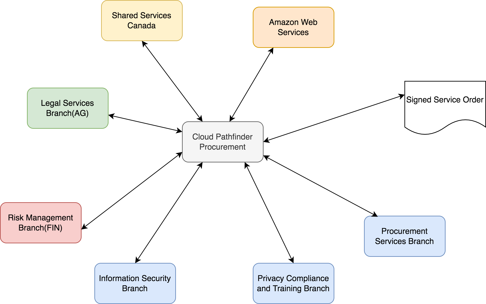
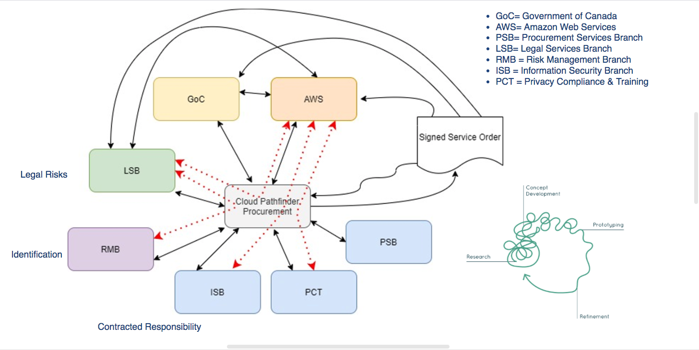

# Procurement Value Proposition

## Negotiation of our First Service Order

Actually it went more like this

## Procurement Value AdD for Ministries

 * Don’t have to negotiate privacy, security, legal terms with vendors
 * Don’t have to dig into the cloud services
 * Only need to focus on describing their project in the PIA and STRA

## Cloud LifeCycle Value Add for Ministries

