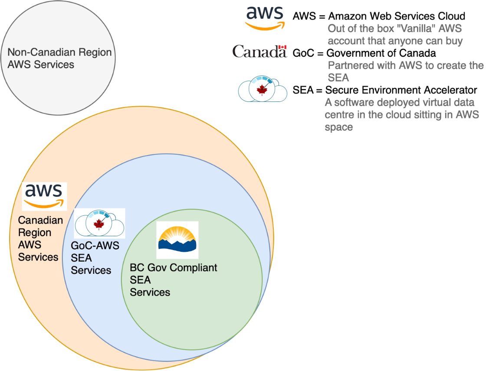
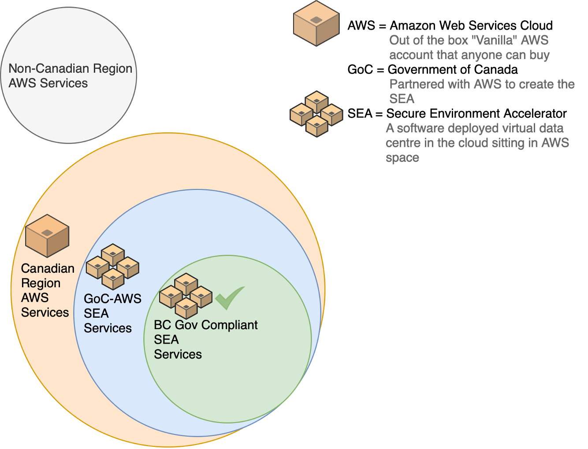
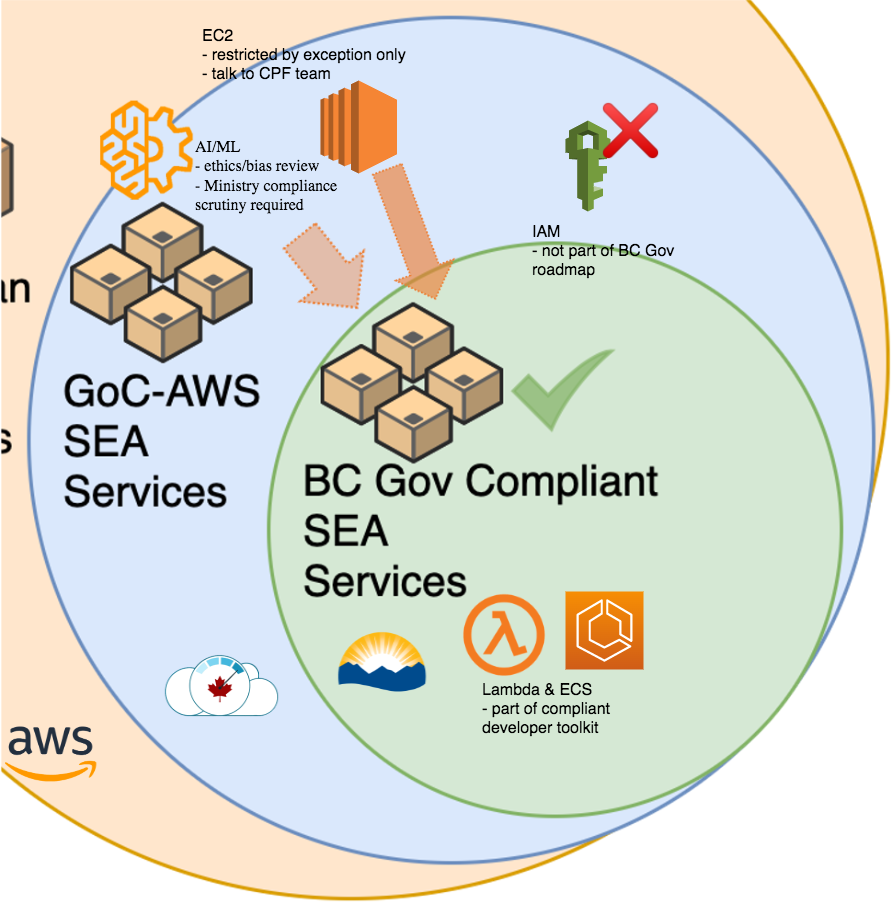
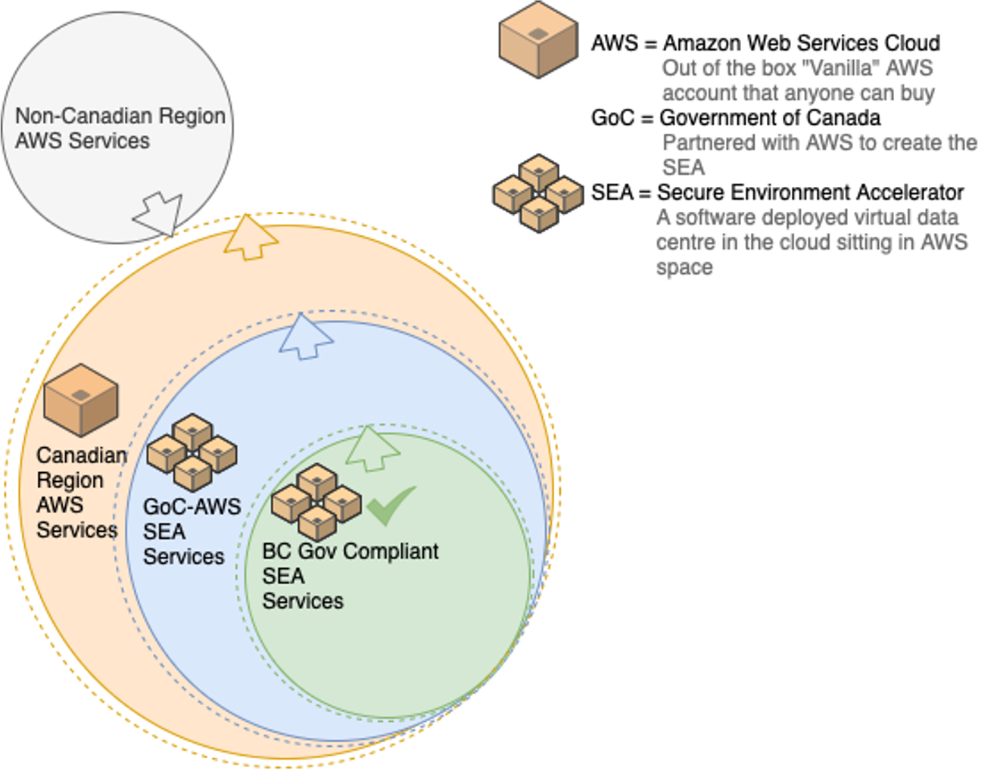
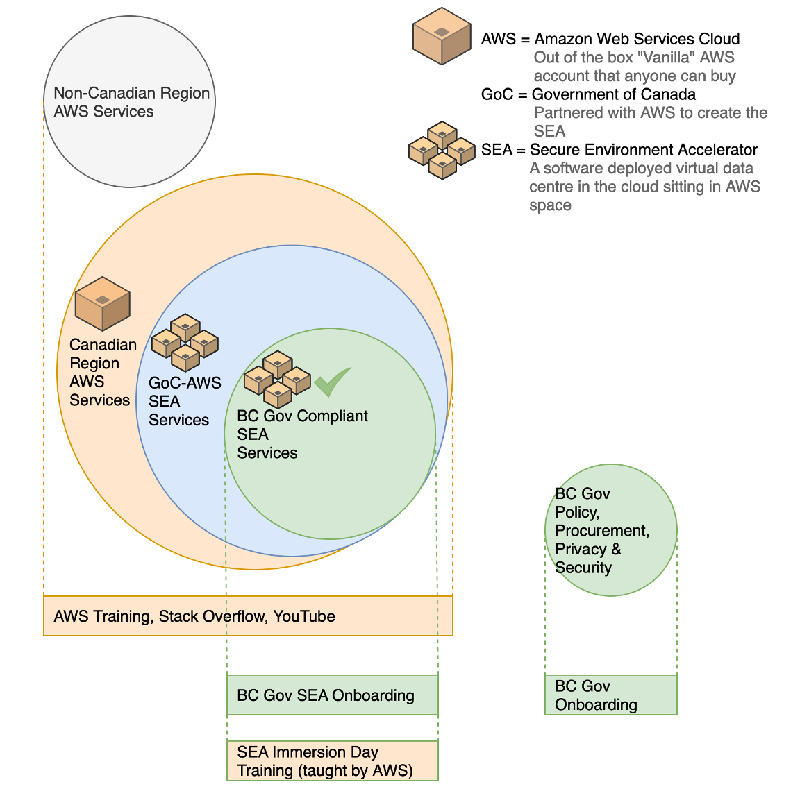
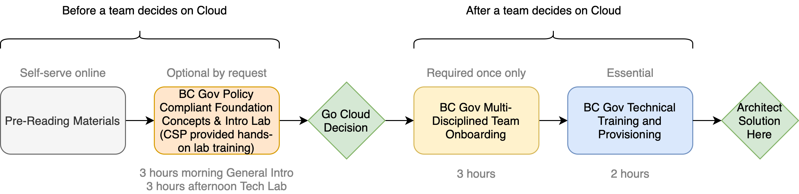

# ECF at BC Government

* The Cloud Pathfinder team have added Automation and Customization layers on top of the Secure Environment Accelerator(SEA) product solution provided by Government of Canada and Cloud Service Provider and calls it Enterprise Cloud Factory.

## BC Government Enterprise Cloud Factory (ECF)

* AWS ECF at BC Government

* The above images shows the relationship between services offered in different scopes of the various contexts of the AWS ECF. BC Government teams will be working primarily in the green area with some services from the blue. 
* The green services have been tested by the Cloud Pathfinder team for good fit within the guardrails of the environment.  
* Some services are not compatible but in general there is a pattern for teams to use the blue ones if needed.

## ECF Concepts
* AWS ECF Concept

## Public Cloud ECF Services
* AWS

::: tip Acronyms

- **CPF:** Cloud pathfinder Team
- **ECS** = Elastic Container Service
- **EC2** = Elastic Compute Cloud/Virtual Machines
- **CSP** = Cloud Service Provider
- **Lambdas** = a serverless technology where code is run on CSP maintained servers, turned off when not in use
- **IAM** = Identity Access Management of users in the CSP
- **AI/ML** = Artificial Intelligence and Machine Learning Cloud services 

:::

* We are aiming for a common service experience regardless of which cloud you are consuming in BC Government.

## ECF Future Growth
Depicted as follows is the growth of services in AWS over time

 * Over time, regardless of the particular brand of the cloud, the number of services in the ECF available to BC Government teams will go up and we expect the green set of services to mostly overlap the blue.
 
## Training Landscape
Below is the Training landscape for the AWS

## Training Components

 * AWS ECF Training Components
 
 

  * We see here that the training available online and from each Cloud Service Provider like AWS does not take into account the SEAs as these are very cutting-edge environments.  Over time the training will catch up.  For now, we have customized training so that teams do not get confused when the patterns they learned elsewhere do not function in the ECF. We show them equivalent, safe ways of operating in the ECF.
  
## Training Track
* Training Track (all CSP pattern)

