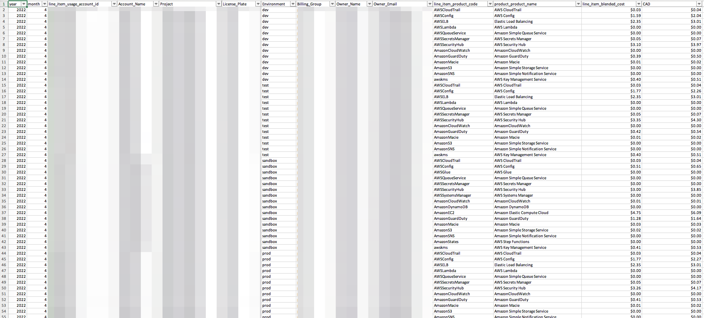
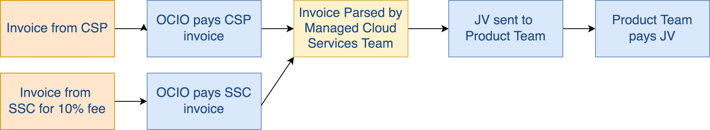

# Billing

## Billing Examples T-Shirt Estimate Scenario 1 - Small
! Usage based Expense may increase or decrease

| AWS Services      | Metrics | Estimated Expense / Month     |
| :---        |    :----:   |          ---: |
| Traffic    | 25 Visitors a day      |  |
| Amazon Simple Storage Service    | 80 GB      | $ 2.00  |
| Elastic Load Balancer    | 300KB/second/client connection      | $ 25.00  |
| Amazon DynamoDB    | 1 GB, 1 million requests      | $ 4.00  |
| Elastic Container Service - Fargate    | 1 container deployed twice, each 2 vCPU, 4GB      | $ 48.39  |
| Data Transfer Out   | 50 GB      | $ 4.50  |
| Amazon CloudWatch Logs   | 50 GB      | $ 28.00  |
| AWS SEA Services(*)   | Amazon GuardDuty, AWS Config, KMS      | $ 40.00  |
| Estimated Monthly Total   | --     | $ 129.14  |

 * ALB: 1.08GB/hr, 25connections/sec, 2min duration,1 request per second
 * Factor in backups, cold storage, dev & test environments which will increase costs depending on how far a team chooses to implement.

## Billing Examples T-Shirt Estimate Scenario 2 - Medium
! Usage based Expense may increase or decrease

| AWS Services      | Metrics | Estimated Expense / Month     |
| :---        |    :----:   |          ---: |
| Traffic    | 250 Visitors a day      |  |
| Amazon Simple Storage Service    | 800 GB      | $ 20.00  |
| Elastic Load Balancer    | 300KB/second/client connection      | $ 88.00  |
| Amazon DynamoDB    | 10 GB, 10 million requests      | $ 18.00  |
| Elastic Container Service - Fargate    | 3 container deployed twice, each 2 vCPU, 4GB      | $ 145.16  |
| Data Transfer Out   | 500 GB      | $ 45.00  |
| Amazon CloudWatch Logs   | 500 GB      | $ 278.00  |
| AWS SEA Services(*)   | Amazon GuardDuty, AWS Config, KMS      | $ 40.00  |
| Estimated Monthly Total   | --     | $ 634.16  |
 * ALB: 10.8gb/hr, 250connections/sec, 2min duration,10 request per second
 * Factor in backups, cold storage, dev & test environments which will increase costs depending on how far a team chooses to implement.

## Billing Examples T-Shirt Estimate Scenario 3 - Large
! Usage based Expense may increase or decrease

| AWS Services      | Metrics | Estimated Expense / Month     |
| :---        |    :----:   |          ---: |
| Traffic    | 2500 Visitors a day      |  |
| Amazon Simple Storage Service    | 8,000 GB      | $ 200.00  |
| Elastic Load Balancer    | 300KB/second/client connection      | $ 712.00  |
| Amazon DynamoDB    | 100 GB, 100 million requests      | $ 178.00  |
| Elastic Container Service - Fargate    | 3 container deployed twice, each 2 vCPU, 4GB      | $ 145.16  |
| Data Transfer Out   | 5000 GB      | $ 450.00  |
| Amazon CloudWatch Logs   | 5000 GB      | $ 2,775.00  |
| AWS SEA Services(*)   | Amazon GuardDuty, AWS Config, KMS      | $ 40.00  |
| Estimated Monthly Total   | --     | $ 4,500.16  |
 * ALB: 10.8gb/hr, 250connections/sec, 2min duration,10 request per second
 * Factor in backups, cold storage, dev & test environments which will increase costs depending on how far a team chooses to implement.

## Custom Cost Examples ?
 Yes!
    
 * AWS Pricing Calculator

* Use [AWS Pricing Calculator](https://calculator.aws) for now 

## Billing Process Example
 * These are samples of periodic billing report files we generate for Ministry teams

* Email sent out to owners of the project every week with attached consumption report.

* The Email contains information about the total cloud consumption cost across the environments and the details of the environments for the period mentioned in the email.

* The Excell spredsheet attached to the email contains the cost spent on each resource  inside the environment

* Note that the cost also include the baseline costs for running the Secure Environment Accelerator guardrail and logging services within each account. You will see service charges from CloudTrail, CloudWatch, Systems Manager, Secrets Manager, S3, Simple Queue Service, Simple Notification Service, AWS Config, Elastic Load Balancing, GuardDuty, Key Management Service, Lambda, Macie, Security Hub, NAT gateway. If your team has a SandBox account workload environment, you will see EC2 charges due to the independent direct networking. We will will be migrating teams away from SandBoxes to more protected workload environments better aligned to the guardrails.

## JV Process

* Accounting process that enables 
    * Cloud Services Providers and Shared Services Canada to invoice BC Government, and 
    * You the ministry teams to pay-per-use to cover this cost while
    * We endeavour to provide a transparent experience
* Occurs every 3 months

