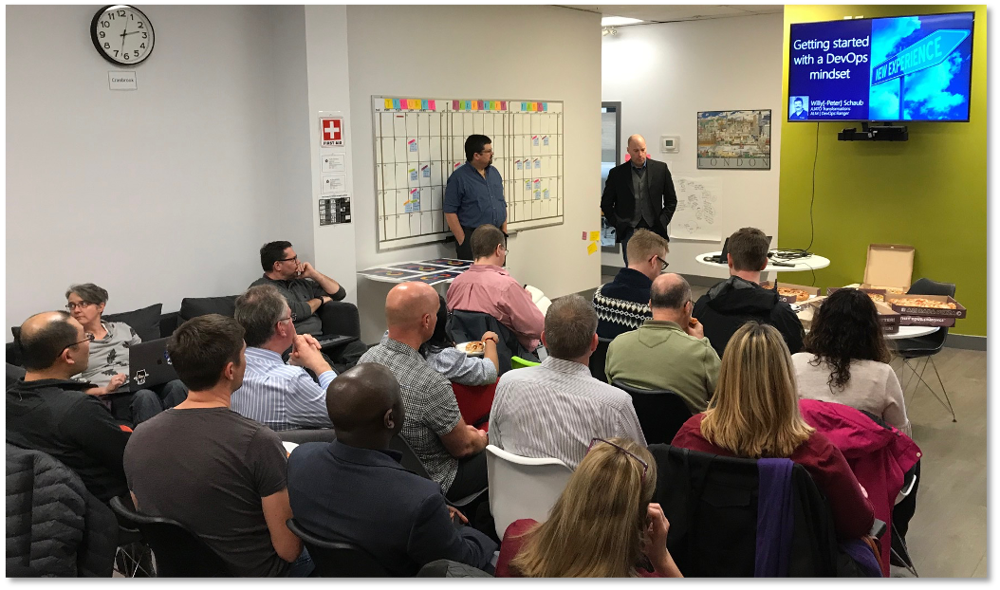
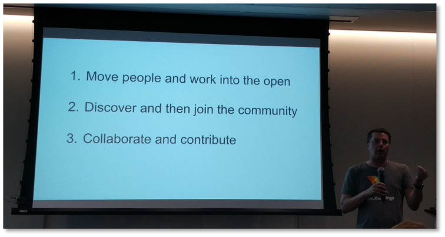
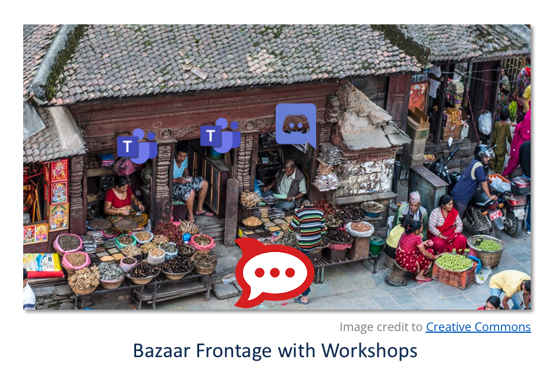

# Communities of practice
 ## Value of Communities
* A strong community will
    * Provide an anser before the platform team can
        * Operational cost savings
        * Faster Service turnarounds
    * Self-organize to co-create reusable artifacts
        * Reduce duplication and one-offs
        * Lighten application maintenance lifecycle requirements
    * Create Stewards
        * Early adopters become Influencers
        * Influencers become Stewards

## Customer Focus – 3 CoPs
---
::: tip Acronyms

- **OCIO** = Office of the Associate Deputy Minister and Government Chief Information Officer

- **CoP** = Community of Practise

- **SecOps** = OCIO Security Operations Team

:::

---
* Our Customers: Project Managers / Product Owners / Expense Authorities  
* Our Users: Developer Teams
* Special Users: Security Operations OCIO

## Service Design Customer Focus
---
::: tip Acronyms
- **UX:** User Experience experts
- **SD:** Service Designer
:::

---

* UX / SD engage with 3 Customer/Users groups
    * Gain deep understanding of needs, workflows, pain points
    * Create tickets from this work prioritizing needs
    * Focus on delivery time
        * Self-serve or fast turnaround
         * Reliability
        * Tools teams need

## Strong Communities in BC Gov

* Devops Commons

* Features
    *  Every 2 Months
    * History from 2016 onwards
    * Community Focused
    * Daily Open Participation
* Promotes
    * Collaboration on Shared efforts
    * Networking across silos
    * Best practices via Stewards
    
## Focus of Teams and Rocket Chat
 Focus on Teams 

* Teams
    * "The Workshop", it
        * Internally connects team
        * Eases conferencing out
        * Is focused primarily on 
            * Leadership
            * Scrum Masters
            * Employees

Focus of RocketChat

* RocketChat
    * “The Bazaar”, and just like OCIO Connect, it
        * Connects People
        * Highlights Best Practices
        * Is Inclusive 
            * Contractors
            * vendors
            * Leadership
            * Scrum Masters
            * Employees

Recommend Both!

* Bazaars and Workshops
    * Together both provide team's collaboration space and access to community
    * Allows others to find your team and modern video call meetings

A Teams platform

A Community platform

* Cloud Pathfinder is available on both 

* Cloud Pathfinder Rocket chat channel : [aws-lz2](https://chat.pathfinder.gov.bc.ca/group/aws-lz2)

