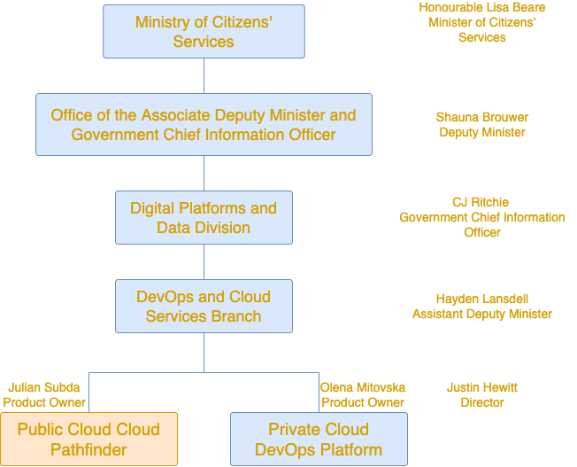

# What is BC Gov Cloud Pathfinder?

- We’re a central team in BC Gov tasked with delivering Cloud
- We’ve onboarded to the GoC Cloud Brokerage
- We have a service order with 1 Cloud Service Provider via an SEA
- We are on a mission to collaborate with the GoC to use several CSPs
- We want to offer a consistent service experience across several clouds; our on-prem OpenShift container platform, GCP, and others.
- Our clients are all Ministries in BC Government

## Customer Focus
- **Our Customers:** Project Managers / Product Owners / Expense Authorities
- **Our Users:** Developer Teams
- **Special Users:** Security Operations OCIO

---

::: tip Acronyms
- **GoC:** Government of Canada
- **CSP:** Cloud Service Provider
- **SEA:** Secure Environment Accelerator, an GCP & GoC cloud multi-tenancy guardrail product
- **OCIO:** Office of the Associate Deputy Minister and Government Chief Information Officer
- **SecOps:** OCIO Security Operations Team
  :::

## Org Landscape

