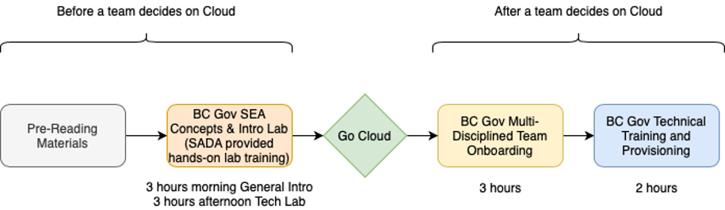
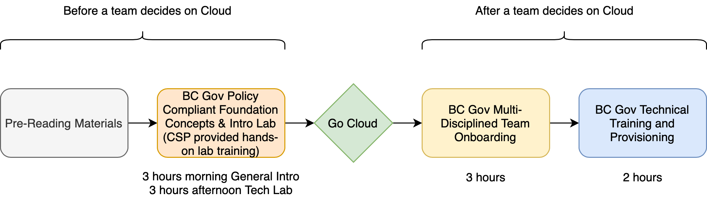

# SEA at BC Gov

## BC Gov’s SEA Cloud

## SEA Concepts

## Compliant Services

::: tip Acronyms
- **VMs:** Elastic Compute Cloud Virtual Machines
- **CSP:** Cloud Service Provider
- **Functions:** A serverless technology where code is run on CSP maintained servers, turned off when not in use
- **IAM:** Identity Access Management of users in the CSP
- **GSF:** Google Serverless Functions
- **GKE:** Google Kubernetes Engine, a CSP managed service
- **AI/ML:** Artificial Intelligence and Machine Learning cloud services
  :::

## SEA Future Growth

## Training
### Training Landscape

#### Training Components

#### Training Track GCP Specific

#### Training Track (all CSP pattern)

