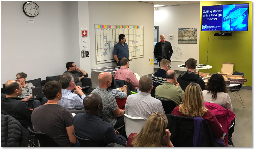
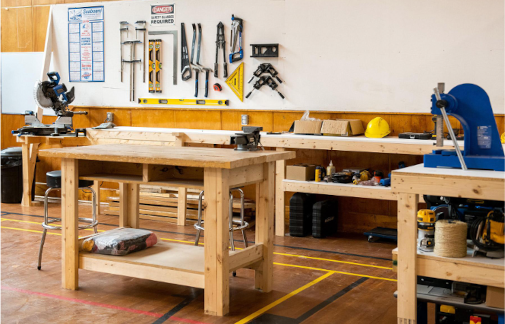
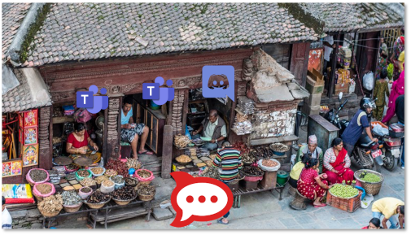

# Communities of Practice

## Value of Communities

### A strong community will
- Provide an answer before the platform team can
    - Operational cost savings
    - Faster service turnarounds
- Self-organize to co-create reusable artifacts
    - Reduce duplication and one-offs
    - Lighten application maintenance lifecycle requirements
- Create Stewards
    - Early adopters become Influencers
    - Influencers become Stewards

---

### Customer Focus – 3 CoPs
- **Our Customers:** Project Managers / Product Owners / Expense Authorities
- **Our Users:** Developer Teams
- **Special Users:** Security Operations OCIO

::: tip Acronyms
- **OCIO:** Office of the Associate Deputy Minister and Government Chief Information Officer
- **CoP:** Community of Practice
- **SecOps:** OCIO Security Operations Team
:::

---

### Service Design Customer Focus
- UX/SD engage with 3 Customer/Users groups
  - Gain deep understanding of needs, workflows, pain points
  - Create tickets from this work prioritizing needs
  - Focus on delivery time
    - Self-serve or fast turnaround
    - Reliability
    - Tools teams need

::: tip Acronyms
- **UX:** User Experience experts
- **SD:** Service Designer
:::

---

### Strong Communities in BC Gov
#### DevOps Commons
1. Move people and work into the open
2. Discover and then join the community
3. Collaborate and contribute

##### Features
- Every 2 months
- History from 2016 onwards
- Community focused
- Daily Open Participation
##### Promotes
- Collaboration on shared efforts
- Networking across silos
- Best practices via stewards

---

### Focus of Teams
#### Teams
- "The Workshop", it
  - Internally connects team
  - Eases conferencing out
  - Is focused primarily on
    - Leadership
    - Scrum Masters
    - Employees

### Focus of RocketChat
- RocketChat
  - "The Bazaar", and just like OCIO Connect, it
    - Connects People
    - Highlights Best Practices
    - Is Inclusive
      - Contractors
      - Vendors
      - Leadership
      - Scrum Masters
      - Employees

### Recommend Both!
- Bazaars and Workshops
  - Together both provide
    - team's collaboration space and
    - access to community
  - Allow
    - others to find your team
    - modern video call meetings
- Cloud Pathfinder is available on both

